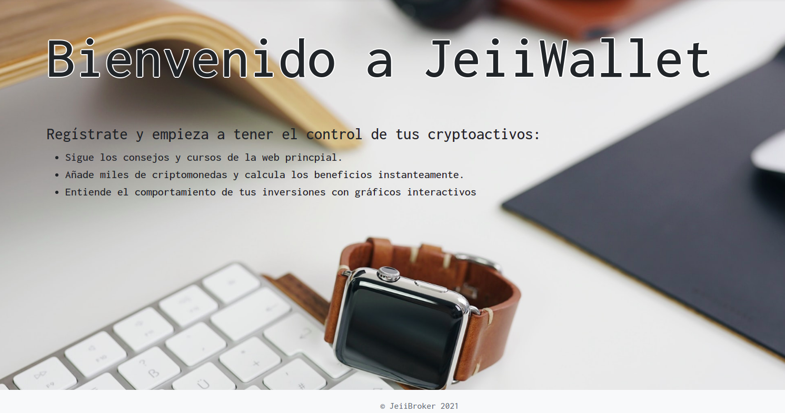

<!--
*** Thanks for checking out the Best-README-Template. If you have a suggestion
*** that would make this better, please fork the repo and create a pull request
*** or simply open an issue with the tag "enhancement".
*** Thanks again! Now go create something AMAZING! :D
-->


<!-- PROJECT SHIELDS -->
<!--
*** I'm using markdown "reference style" links for readability.
*** Reference links are enclosed in brackets [ ] instead of parentheses ( ).
*** See the bottom of this document for the declaration of the reference variables
*** for contributors-url, forks-url, etc. This is an optional, concise syntax you may use.
*** https://www.markdownguide.org/basic-syntax/#reference-style-links
-->


<!-- PROJECT LOGO -->
<br />
<p align="center">
  <a href="https://github.com/othneildrew/Best-README-Template">
    
  </a>

  <h3 align="center">CrpytoWallet Value Tracker</h3>

  <p align="center">
    Keep up with the changes and profits from your crypto assets!
    <br />
  </p>
</p>


<!-- TABLE OF CONTENTS -->
<details open="open">
  <summary>Table of Contents</summary>
  <ol>
    <li>
      <a href="#about-the-project">About The Project</a>
      <ul>
        <li><a href="#built-with">Built With</a></li>
      </ul>
    </li>
    <li>
      <a href="#getting-started">Getting Started</a>
      <ul>
        <li><a href="#data-model">Data Model</a></li>
        <li><a href="#prerequisites">Prerequisites</a></li>
        <li><a href="#installation">Installation</a></li>
      </ul>
    </li>
    <li><a href="#roadmap">Roadmap</a></li>
    <li><a href="#license">License</a></li>
    <li><a href="#contact">Contact</a></li>
  </ol>
</details>


<!-- ABOUT THE PROJECT -->
## About The Project

Keep track of your cryptoassets:<br />
![Wallet][product-screenshot_3]

Portfolio share:<br />
![Cheese][product-screenshot]

Portfolio time-behavior:<br />
![Line Graph][product-screenshot_2]


This project is half-done and with lots of room to improvement but it serves the basic functionalities I wanted to implement!
You will find real-data updates, plotting.
Note that I am not a professional and I am just doing it as a hobby, any comment to improve is more than appreciated.

### Built With

This project uses mostly:
* [Bootstrap](https://getbootstrap.com)
* [JQuery](https://jquery.com)
* [Nodejs](https://nodejs.org)
* [Docker](https://www.docker.com)


<!-- GETTING STARTED -->
## Getting Started

### Data Model

Using mongo documents, three collections related as shown:


![Data Model][data-model]


### Prerequisites

The following steps are required before running the project:

* Installing Node
  ```sh
  sudo apt install nodejs
  ```

* Installing Docker
  ```sh
   sudo apt-get install docker-ce docker-ce-cli containerd.io
  ```

### Installation

1. Get a free API Key at [https://api.nomics.com](https://api.nomics.com)
2. Get a free API Key at [https://www.cryptocompare.com/](https://www.cryptocompare.com/)

2. Clone the repo
   ```sh
   git clone https://github.com/your_username_/Project-Name.git
   ```

3. Install NPM packages
   ```sh
   npm install
   ```

4. Create a .env file with API_NOMICS_KEY, API_CRYPTOCOMPARE_KEY, SESSION_KEY(set your value) and fill the values.

5. Run the application and it should be running on [https://localhost:3000](https://localhost:3000)
```sh
  docker-compose up -d
```


<!-- ROADMAP -->
## Roadmap

Tasks to be done:

* Improve API calls for efficiency.
* Edit the entries in the HTML table manually if data can't be fetched.
* More stats & Graphs.
* Boostrap, design & responsive.


<!-- LICENSE -->
## License

Distributed under the MIT License. See `LICENSE` for more information.


<!-- CONTACT -->
## Contact

Alejandro Martínez Otal - [Linkedin](https://www.linkedin.com/in/alejandro-martinez-otal/) - amartinezotal@gmail.com

Project Link: [https://github.com/AlejandroUPC/cryptoWallet](https://github.com/AlejandroUPC/cryptoWallet)


<!-- MARKDOWN LINKS & IMAGES -->
<!-- https://www.markdownguide.org/basic-syntax/#reference-style-links -->
[product-screenshot]: img/cheese.png
[product-screenshot_2]: img/line.png
[product-screenshot_3]: img/wallet.png
[data-model]: img/dmodel.png

